# 🔭 Monitoring with Prometheus & Grafana  
**Production-Style Kubernetes Observability on Azure (AKS)**


---

## 📌 Overview

This project demonstrates a **real-world Kubernetes monitoring and visualization setup**
using **Prometheus** and **Grafana**, deployed on **Azure Kubernetes Service (AKS)**.

The stack is installed using **Helm** and automated with a **Bash script**, providing
live visibility into CPU, memory, networking, and storage performance for running workloads.

---

## 🧱 Project Structure

```text
Monitoring-with-Prometheus-Grafana/
├── code/
│   └── setup-monitoring.sh
├── images/
│   ├── cpuquota.png
│   ├── currentbandwidth.png
│   ├── dashboards.png
│   ├── headlinescpuusage.png
│   ├── memorynetworkusage.png
│   ├── packetsbandwidth.png
│   ├── storageiodistribution.png
│   ├── terminalmonitoring.png
│   ├── terminalmonitoring1.png
│   ├── terminalmonitoring2.png
│   ├── terminalmonitoring3.png
│   ├── setupmonitoring.sh.png
│   ├── setupmonitoring.sh1.png
│   └── welcometografana.png
└── README.md

⚙️ Automation Script (Helm + Bash)
The entire observability stack is deployed using a single script:

bash
Copy code
code/setup-monitoring.sh
Script Evidence


🖥️ Deployment Evidence (AKS)
These screenshots show the Helm installation and service exposure process.

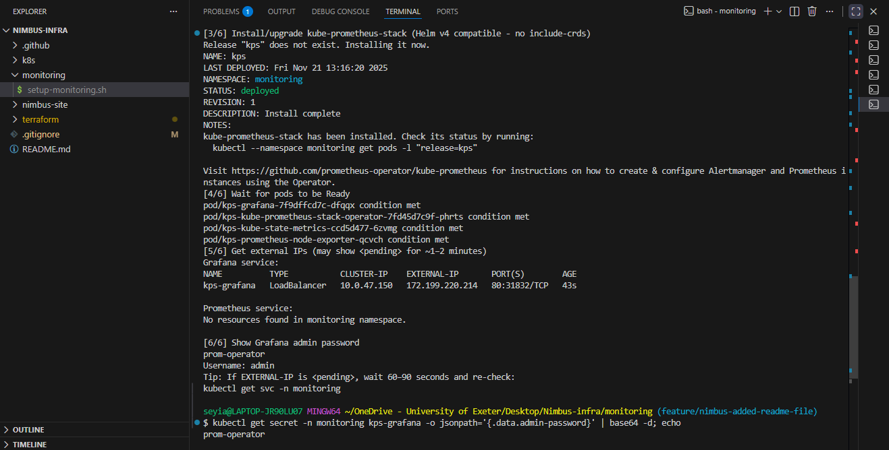
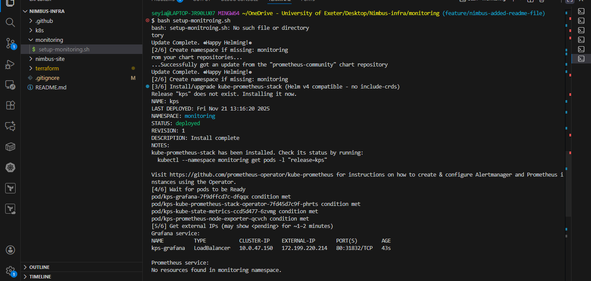
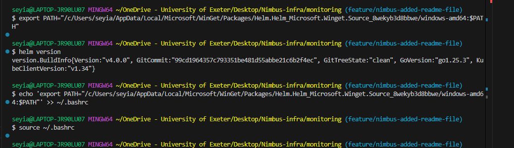
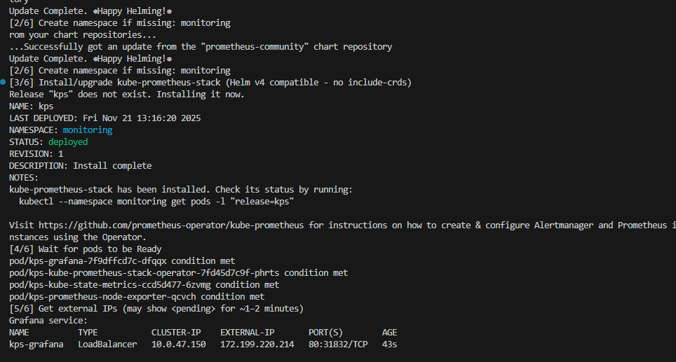

🔐 Grafana Login
Grafana is exposed via an AKS LoadBalancer.

⚙️ Automation Script
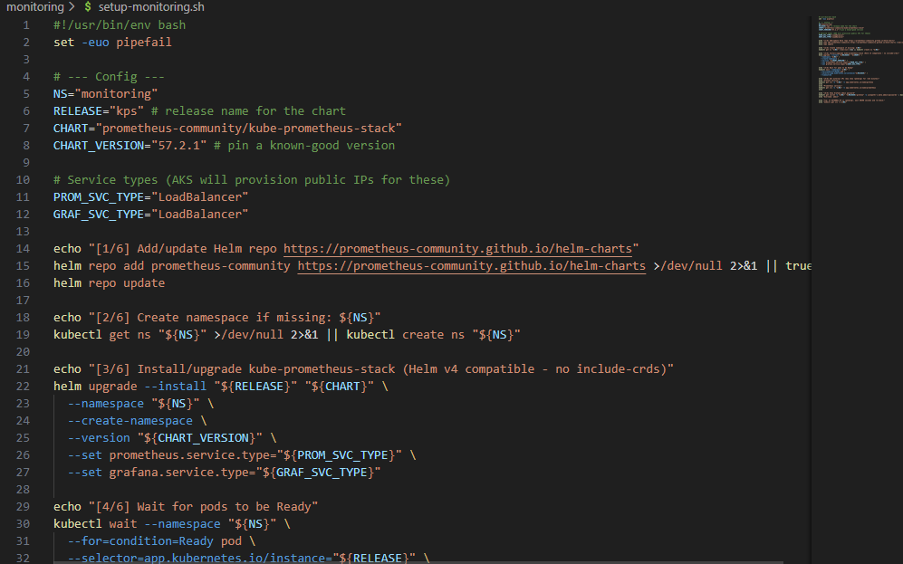
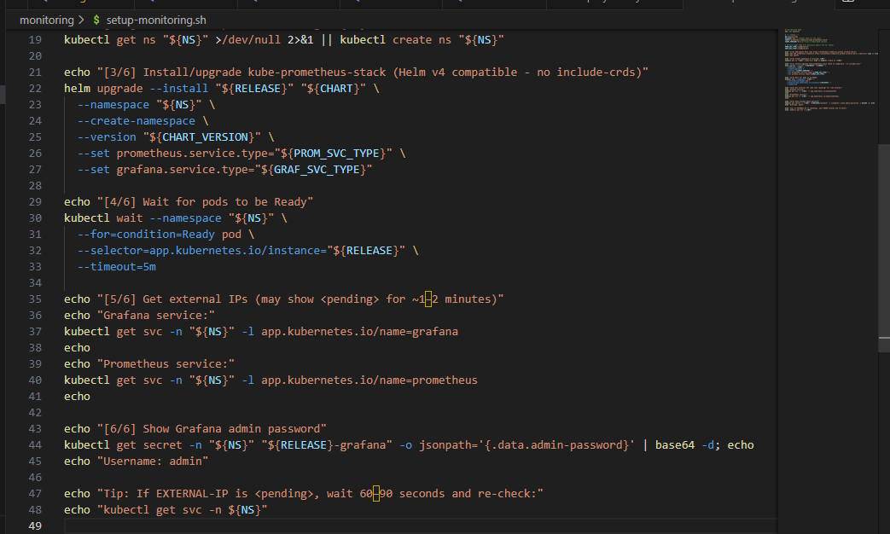

📊 Dashboard Browser
Grafana automatically provisions Kubernetes dashboards via the
kube-prometheus-stack.

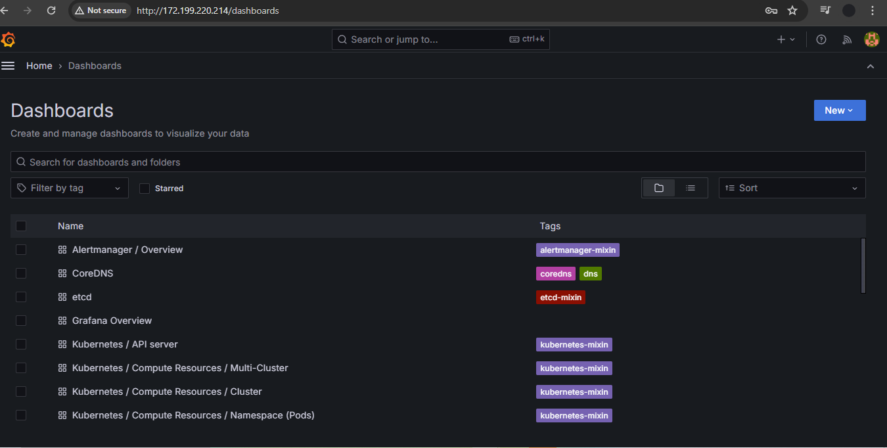

📈 Live Performance Metrics
🧾 Cluster Headlines

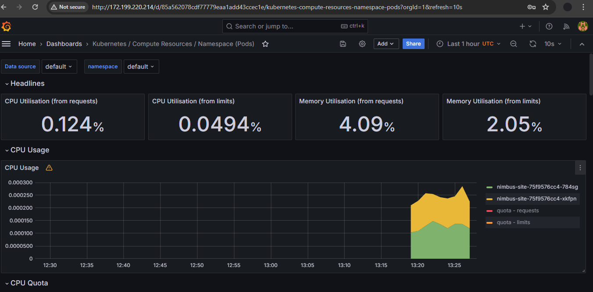

🧮 CPU Usage & Quota

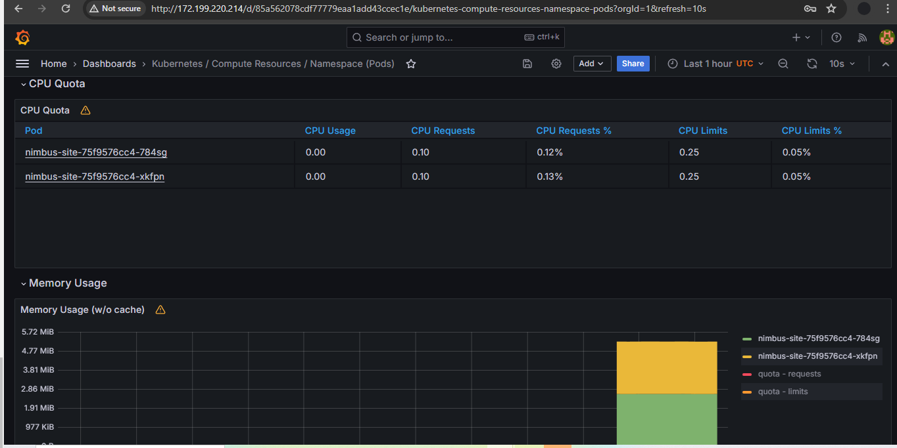

💾 Memory Usage & Network

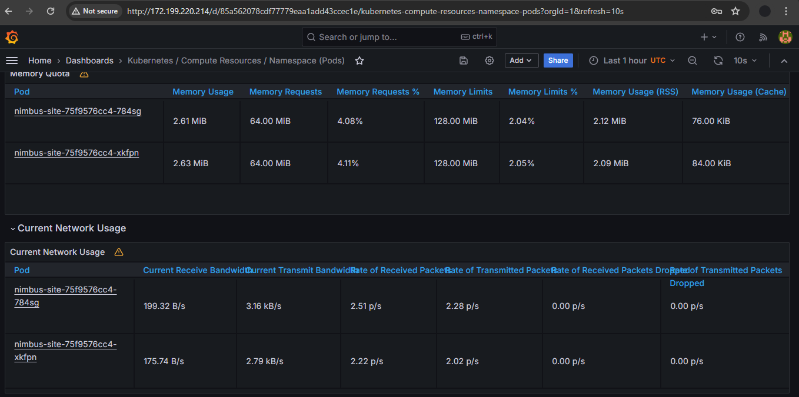

📡 Network Bandwidth & Packets

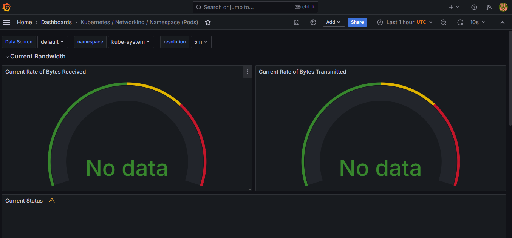
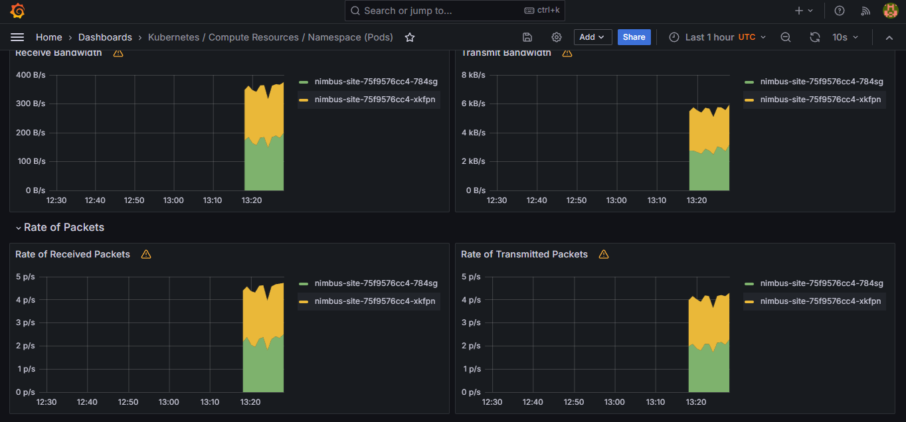

🧱 Storage I/O Distribution

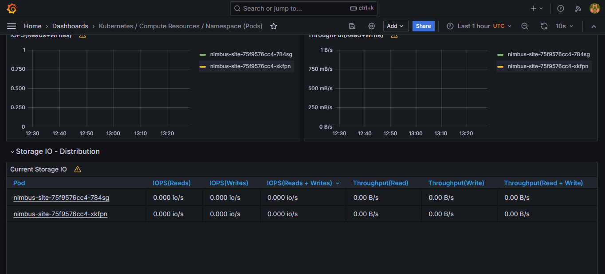

🚀 Skills Demonstrated
Kubernetes Monitoring & Observability

Prometheus metric scraping

Grafana dashboard analysis

Helm-based deployments

Bash automation

AKS operational tooling

👤 Author
Oluwaseyi Adesegun Bello
DevOps Engineer | MSc Human-Centred AI

🔗 GitHub: https://github.com/seyiabello
🔗 LinkedIn: https://www.linkedin.com/in/oluwaseyi-bello-2653a2215/

